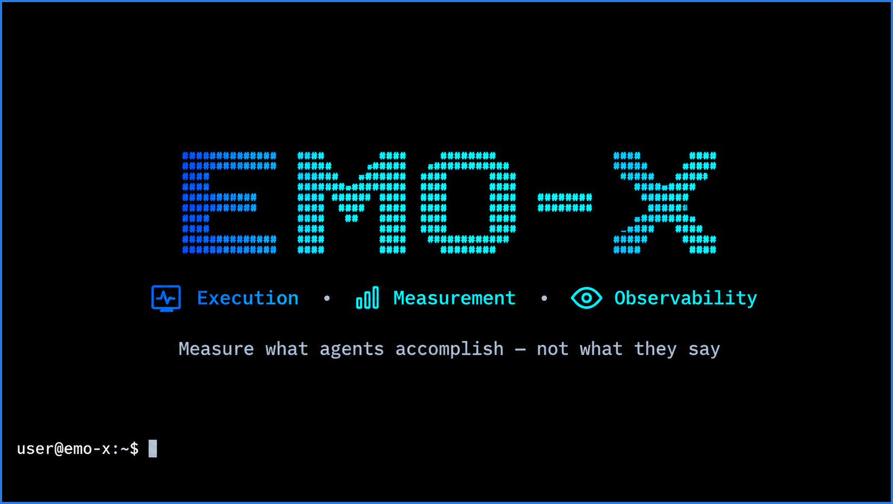
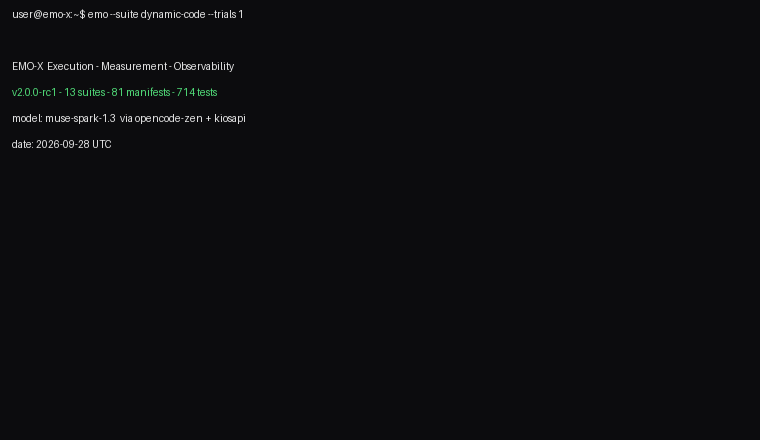

# EMO-X

<picture>
  <source media="(prefers-color-scheme: light)" srcset="src/emo-x-banner-light.png" />
  
</picture>

> HumanEval is dead. EMO-X tests what agents **DO**, not what they **SAY**.

[](https://colab.research.google.com/github/SE-Emam/EMO-X/blob/main/notebooks/emo_x_quickstart.ipynb) [](https://github.com/SE-Emam/EMO-X/stargazers) [](https://pypi.org/project/emo-x-eval/) [](https://huggingface.co/datasets/SE-Emam/EMO-X-Core) [](https://pypi.org/project/emo-x-eval/) [](LICENSE)
[](suites/) [](tests/run_all.py) [](INSTALL.md)


## Live model run (splash → progress → profile chart)

Real runs, real numbers (DC1 subset, 2026-09-28 UTC):



## Quickstart (60 seconds)

```bash
git clone https://github.com/SE-Emam/EMO-X
cd EMO-X
python3 shared/run.py --self-test   # must end: RESULT: PASS
```
```bash
pip install emo-x-eval
emo --self-test
```

## What it measures

| Suite | What it tests | Why it matters |
|---|---|---|
| code25 | 36 code/tool task families with execution or deterministic structural oracles | beyond pass/fail snippets |
| agent-loop | inspect → locate → patch → test → stop | measures efficiency, not just fixing |
| security | refusal, injection, sandboxed CTF-mini | safety under attack |
| vision | UI grounding, Arabic reading, counting | multimodal grounding |
| issues | IS1–IS15 repair + held-out hidden tests | real-issue repair |
| realworld | mini-repo fixtures + trajectories | ecological validity |
| recovery / robustness / calibration / long-horizon / gauntlet | faults, drift, abstention, chains, compounds | deployment behavior |
| adapters | opencode / pi / hermes drivers | harness+model honesty |

## Features

- ⚙️ **Execution, not eyeballing** — real toolchains; text similarity never counts.
- 🧬 **Dynamic variants** — canonical/perturbed/novel from seeds; contamination-resistant.
- ⏱️ **Trajectory-aware** — tool calls, recoveries, re-planning, clean stops scored.
- 🧪 **Failure fingerprints** — one primary cause per failure, not a bare zero.
- 📊 **Statistical honesty** — bootstrap 95% CIs (SPEC §B54); no winner without an interval.
- 🩺 **Self-auditing** — saturation/flakiness/contamination flagged by rule.
- 🔒 **Sealed provenance** — immutable hashed bundles; changes void comparability.

## Why use EMO-X

Single-number leaderboards hide what matters in deployment: cost per
solve, recovery, safety, calibration, generalization. **A model that
scores 65% cheaply, safely, and robustly is not the same system as one
that scores 65% expensively and brittlely** — EMO-X measures the
difference. (Deeper framing: `SPEC.md` §48–49; complementary to
SWE-bench, not competitive.)

## Run your first model

```bash
ollama pull qwen3:1.7b
EMOX_ALLOW_LOCAL=1 python3 shared/run.py --backend openai-generic \
  --base-url http://localhost:11434/v1 --model qwen3:1.7b \
  --suite code25 --out results/
```

Any OpenAI-compatible endpoint works the same way (`--base-url` +
`--model` + key). No install path: open the Colab badge above.

## Open leaderboard — no official baseline yet

> **Be the first to submit one.** Run any model with 3 trials on the
> frozen suites, keep the sealed raw bundle, and open a PR adding it
> under `results/community/` — the board ranks only COMPARABLE runs
> (identical prompt/harness/manifest hashes), so no one can game it.

## Full quickstart

# any OpenAI-compatible endpoint (OpenAI, OpenRouter, DeepSeek, Gemini, vLLM, Ollama…)
python3 shared/run.py --backend openai-generic \
  --base-url https://HOST/v1 --model MODEL-ID --api-key "$KEY" \
  --suite code25 --out results/

# fixed client report + QA stamp
python3 shared/run.py --report results/<model>_<stamp>.json --model MODEL-ID
```

See **[INSTALL.md](INSTALL.md)** for full install/run/troubleshooting,
**[PLAN.md](PLAN.md)** for the methodology, and **[REPORT_TEMPLATE.md](REPORT_TEMPLATE.md)**
for the fixed client-report contract.

## Worked example (end to end)

```bash
# 0. Harness check — deterministic, must print RESULT: PASS
python3 shared/run.py --self-test
#   code-extraction  PASS  ok
#   python-executor  PASS  ok
#   ...
#   RESULT: PASS

# 1. Run two models on the same frozen suite
python3 shared/run.py --backend openai-generic --suite code25 \
  --model MODEL-A --trials 3 --out results/
python3 shared/run.py --backend openai-generic --suite code25 \
  --model MODEL-B --trials 3 --out results/

# 2. What lands on disk (never edited afterwards)
results/raw/RUN-code25-<stamp>-<id>/
├── manifest.json      # prompt/harness/backend hashes, sampling, seed
├── events.jsonl       # one schema-valid record per attempt
├── responses.jsonl    # verbatim model outputs
├── environment.json   # toolchain, platform, hardware class
└── seal.json          # tamper-evident seal (D3)

# 3. Compare with intervals, not point gaps
python3 -c "
from shared.report_v2 import compare_models, render_comparison
# ...load the two bundles, then:
print(render_comparison(comp))"
# Difference: +2.1 pp  95% CI [-1.4 pp, +5.8 pp]
# Status: inconclusive — do not rank on this gap.
```

## Numbers (measured, not claimed)

| What | Count | Source |
|---|---|---|
| Test suites | 14 | `suites/*/` |
| Task manifests | 98 | `suites/*/manifests/*.json` |
|  Harness + unit tests | 832 (harness 324, generators 82, scoring 210, golden 30, backends 186) | `tests/run_all.py --count`, all green  |
| Self-test checks | 14 | `--self-test`, fail-closed |
| Issue-style families | 15 (IS1–IS15) | vs SWE-bench Lite (300) = **5.0%** |

Comparison with SWE-bench (verified 2026 from swebench.com):

| Dimension | SWE-bench | EMO-X |
|---|---|---|
| Task realism | 2,294 real GitHub issues | 15 issue-style + 3 mini-real fixtures (synthetic, documented) |
| Headline metric | % Resolved (one number) | Capability profile (9 dims + fingerprint + CI) |
| Contamination defense | Static set (known exposure) | Dynamic variants + hidden suite + rotating seeds |
| Statistics | Point estimates | Paired bootstrap 95% CI; no fixed gap rules |
| Cost | Docker-heavy | stdlib only, local, minutes |
| Scope | Code repair (+ multilingual/multimodal) | Repair + security + calibration + recovery + vision + long-horizon |

Honest reading: SWE-bench leads on ecological validity and adoption;
EMO-X leads on measurement science and cost. They answer different
questions — use both.

## Roadmap

| Milestone | Content | Status |
|---|---|---|
| v2.0-alpha | Contracts, sandbox, scoring + goldens, DSL, Core-25, taxonomy | Done (this tree) |
| v2.0-beta | Recovery, drift, tool discipline, calibration, health | Done (suites + `health/`) |
| **v2.0.0-rc1** (current) | Gauntlet, long-horizon, adaptive difficulty, scoring conformance | Code done; **no published OFFICIAL baseline yet** |
| v2.0 | First sealed 3-trial OFFICIAL baseline (R3) | Pending baseline |
| Next | 15→30 issue families; vision out of PILOT; first 3-trial public baseline with CI | Planned (`PLAN-X.md` WP12–WP15) |

No model scores are published in this repo: any number without a sealed
`results/raw/RUN-ID/` bundle is inadmissible here.

## Methodology in one paragraph

Frozen `PROMPT_PACK` + fixed harness per comparison (harness+model is the unit);
n=3 with mean±SE; model gaps are judged only by paired cluster-bootstrap 95%
intervals (B54) — no fixed point-gap rule; tokens-per-solved-task, latency and
failure taxonomy reported next to pass rates; raw traces retained; void rounds labeled,
never silently merged. Details in `PLAN.md` §0.
